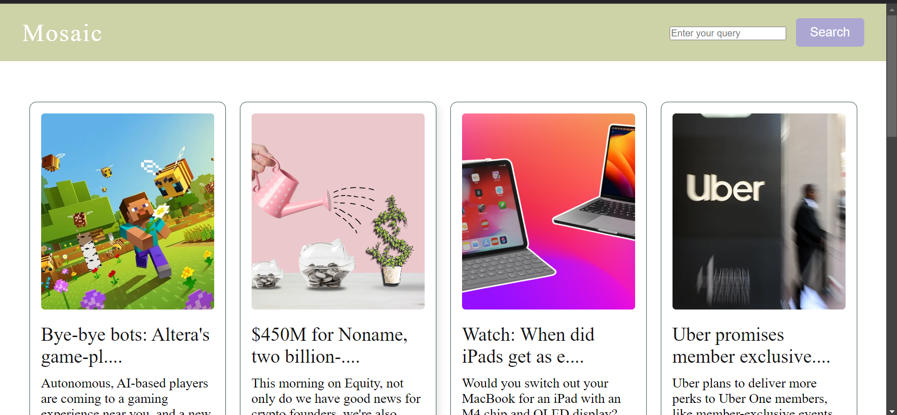

# Multi-Resource News Aggregator

## **Table of Contents**

1. [Overview](#features)
2. [Features](#features)
3. [File Structure](#File-Structure)    
4. [Technologies Used](#technologies-used)
5. [Setup Instructions](#installation)
6. [Running Locally](#Running-Locally)
7. [Demo](#Demo)


## Overview
This project is a simple **Multi-Resource News Aggregator** that collects and displays news from multiple sources. It consists of an HTML interface, styled using CSS, and powered by JavaScript for interactivity.

---

## Features
- User-friendly interface for searching and viewing news.
- Responsive design for seamless viewing on different devices.
- Fetches data dynamically from multiple news sources.
- Displays error messages for invalid or empty input.

---

## File Structure
- **index.html**: Contains the structure of the webpage and HTML elements.
- **style.css**: Styles the webpage (colors, layout, typography).
- **script.js**: Handles interactivity, like fetching and displaying news.
- **images/**: Folder containing images used for the website (e.g., `news.png`, `screensho.png`).
- **README.md**: Contains information about the project, installation, and usage.


---

## Technologies Used
- **HTML5:** Structure and content.
- **CSS3:** Styling and responsive design.
- **JavaScript:** Dynamic functionality (e.g., search and API calls).

---

## Setup Instructions
1. Clone this repository:
   ```bash
   git clone <rhttps://github.com/TaoufikBenlhosniDev/MosaicNews.git>

### Running Locally
- Navigate to `http://localhost:5500` (or your configured port) to access the website.

### **Demo**


---
